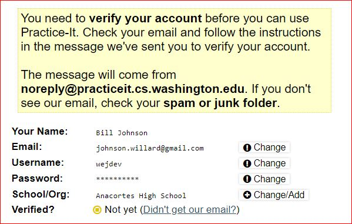

# LearnJava

Links and documents to help learn the Java programming language

## Building Java Programs: A Back to Basics Approach

This is the book. Buying it is very expensive, because it's used for a lot of schools and in high demand. We're going to use the presentations to learn the material along with question/answer sessions during the robotics sessions.

http://www.buildingjavaprograms.com/supplements4.shtml

## Accompanying Practice Sites

You'll have to sign up for the practice site. There's no charge. You'll have to create an account and user and verify it by email. Once in, you can start working on the problems. After setting up your account, go to the problems page and start with the Building Java Programs, 4th Edition section. https://practiceit.cs.washington.edu/problem/list

https://practiceit.cs.washington.edu/

There's a second site that's very similar, also written by one of the authors, which has other problems.

https://www.codestepbystep.com

Sample sign up sequence:

